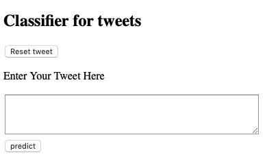
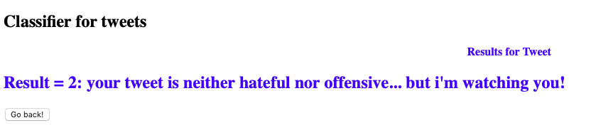

**Tweets sentiment analysis with Flask and Docker**

This repository provides the necessary files to run a Flask application that classify tweets into 3 labels: \
0 - hate speech \
1 - offensive  language \
2 - neither hateful nor offensive \

**The home page:** \
 

**The result page:** \


**Step 01: clone this repository on your machine**
```bash
$ git init
$ git clone https://github.com/stephanBV/tweets_sentiment_analysis.git
```
**Step 02: build your docker image (here named "tweet_flask") and run processes in the isolated container. Copy and paste the following command in your terminal:** 
```bash
$ docker build --tag=tweet_flask .          
$ docker run -p  12345:12345 tweet_flask
```
Executing this last line of code might take a moment as the model is training for the first time. A .pkl is created containing the trained model.

**Step 03: then, copy the address http://0.0.0.0:12345/ and paste it in your browser**

**Step 04: enter your tweet, click on predict, get the result, go back and reset tweet to enter another one**

Enjoy! :)

Note : opening flask on port 12345 is a personal preference.
